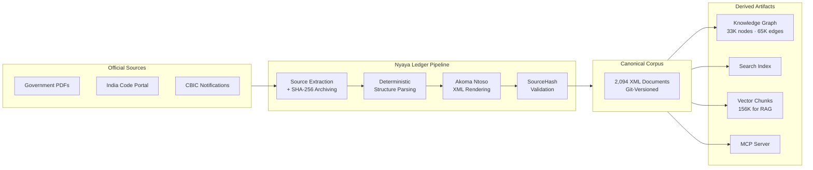
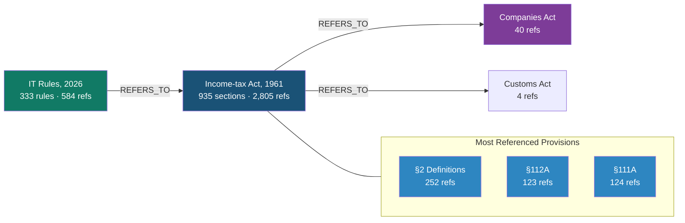
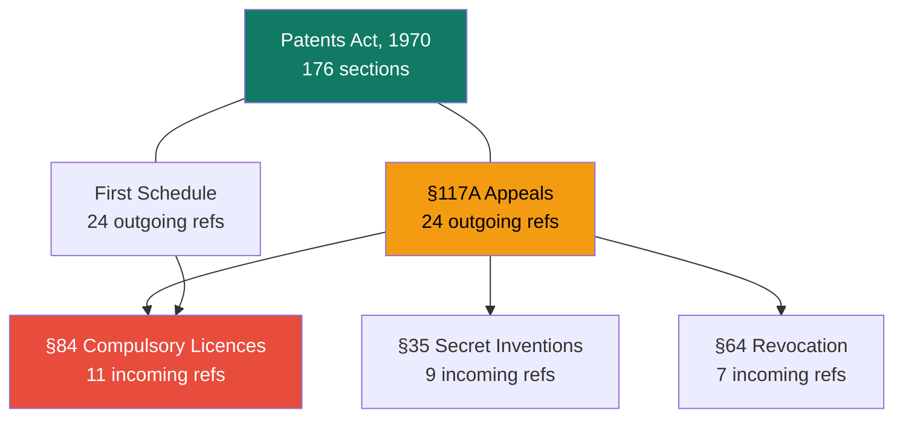
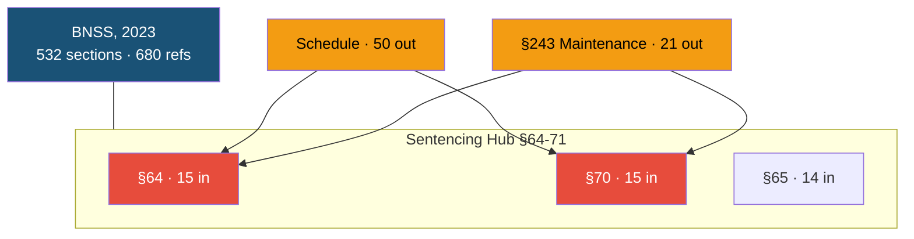
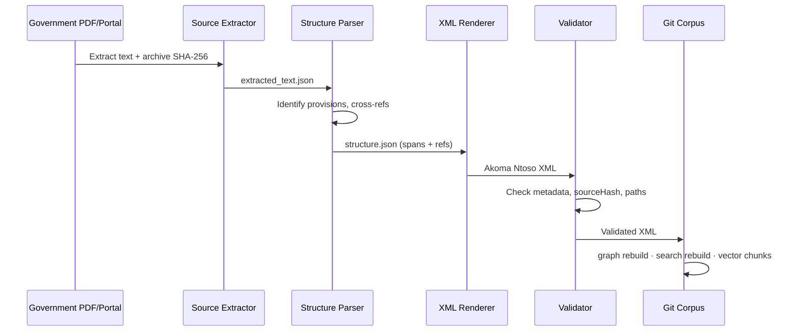

<p align="center">
  
  
  
  
  
</p>

<h1 align="center">Nyaya Ledger</h1>

<p align="center">
  <strong>The open-source legal data pipeline that makes Indian legislation machine-readable, versionable, and queryable.</strong>
</p>

<p align="center">
  <em>Nyaya</em> (Sanskrit: न्याय) &mdash; justice, logic, method.
</p>

---

## The Problem

India's legal system generates thousands of pages of legislation each year
across hundreds of statutes, rules, notifications, and circulars. This
material lives in PDFs, scanned gazettes, and fragmented government portals.
There is no single machine-readable, version-controlled, cross-referenced
source of truth.

A chartered accountant tracing why Section 112A of the Income-tax Act says
what it says &mdash; which Finance Act inserted it, which notification amended
it, which rule operationalises it &mdash; must manually cross-reference
dozens of documents. A legal AI assistant cannot answer that question because
no structured data exists.

**Nyaya Ledger** exists to change that.

---

## What It Does

Nyaya Ledger is a deterministic pipeline that converts Indian legal documents
into structured, provenance-tracked, cross-referenced knowledge artifacts:

| Output | Description | Use Case |
|---|---|---|
| **Akoma Ntoso XML** | Per-provision legal text with cryptographic source provenance | Authoritative legal reference |
| **Knowledge Graph** | 65K+ cross-reference edges across 574 statutes | Regulatory impact analysis |
| **Search Index** | 33K+ full-text search records | Legal research tools |
| **Vector Chunks** | 156K+ RAG-ready text chunks | AI legal assistants |
| **MCP Server** | Model Context Protocol interface | Agent-native legal intelligence |

Every XML element carries a `sourceHash` (SHA-256 of the exact source-text
span), so any provision can be independently audited against the original
government document.

---

## Corpus at a Glance

| Metric | Value |
|---|---|
| **Statutes** | 574 Acts of Parliament |
| **Notifications** | 1,216 CBIC notifications |
| **Rules** | Income-tax Rules, CGST Rules, and more |
| **Forms** | 297 prescribed legal forms |
| **Total XML documents** | **2,094** |
| **Provisions** | 33,766 |
| **Cross-references** | **65,313** (97% resolved) |
| **RAG-ready chunks** | 156,882 |
| **Source archives** | 1,985 |

### Legal Domain Coverage

| Domain | Statutes |
|---|---|
| **Tax & Revenue** | Income-tax Act (935 sections), CGST Act, Customs Act, Central Excise Act, 46 total |
| **Criminal Law** | Bharatiya Nyaya Sanhita, BNSS, BSA, IPC, CrPC, PMLA, 11 total |
| **Corporate** | Companies Act 2013, IBC, Competition Act, SEBI Act, 21 total |
| **Intellectual Property** | Patents Act 1970, Copyright Act 1957, Trade Marks Act 1999 |
| **Labour & Employment** | Industrial Disputes Act, EPF Act, Code on Wages, 22 total |
| **Banking & Finance** | RBI Act, Banking Regulation Act, SARFAESI Act, 12 total |
| **Environment** | Environment Protection Act, Forest Act, Wildlife Act, 19 total |
| **Civil & Property** | Indian Contract Act, Transfer of Property Act, 24 total |
| **Constitutional** | Representation of the People Act, Electoral Bond Scheme, 9 total |
| **Digital & Tech** | IT Act 2000, DPDP Act 2023, Aadhaar Act, 5 total |

---

## Architecture



### Design Principles

1. **Git is the canonical history.** Databases and indexes are rebuildable
   derived artifacts. `corpus/` is the single source of truth.
2. **Deterministic parsing.** The same source document always produces the
   same XML. No LLM required for the core pipeline.
3. **Cryptographic provenance.** Every XML element carries `sourceStart`,
   `sourceEnd`, and `sourceHash` linking it to the exact bytes of the
   original government document.
4. **Cross-reference graph.** 65,313 edges connect provisions across 574
   statutes, enabling regulatory impact analysis.
5. **Agent-native.** MCP server exposes the entire corpus as tools for
   AI agents and LLM-based workflows.

---

## Knowledge Graph Snapshots

### Income-tax Act, 1961 &mdash; Cross-Reference Network

The most interconnected statute: 935 sections with 2,805 references spanning
40+ other acts. The Income-tax Rules, 2026 add 584 references back to IT Act
sections.



### Patents Act, 1970 &mdash; Internal Hub Structure

176 sections with 187 internal cross-references. §84 (compulsory licences)
is the most-referenced provision, serving as the central hub.



### BNSS, 2023 &mdash; Sentencing Hub Cluster

India's new criminal procedure code: 532 sections, 680 internal
cross-references. Sections 64-71 (sentencing limits) form a dense hub
targeted by 50+ referring provisions.



---

## Source Provenance

Every XML element carries cryptographic proof of origin:

```xml
<section eId="section_112a"
         refersTo="/in/union/acts/income-tax-act-1961/section/112a"
         sourceStart="48912"
         sourceEnd="49301"
         sourceHash="a1b2c3d4..."
         sourceNodeType="section"
         sourceConfidence="0.9">
  <num>112A</num>
  <content>
    <p>* Section 112A. Tax on long term capital gains.-</p>
    <paragraph eId="section_112a__para_1"
               sourceStart="49302" sourceEnd="49650"
               sourceHash="e5f6a7b8...">
      <content><p>(1) Notwithstanding anything contained in ...</p></content>
      <references>
        <ref eId="section_112a__para_1__ref_1"
             href="/in/union/acts/income-tax-act-1961/section/112"
             type="REFERS_TO"/>
      </references>
    </paragraph>
  </content>
</section>
```

The `sourceHash` is `sha256(extracted_text["text"][sourceStart:sourceEnd])` &mdash;
independently verifiable against the archived source extraction.

---

## Quick Start

```bash
git clone https://github.com/shikharpant/git-for-law.git
cd git-for-law
pip install -r requirements.txt
make test
```

### Ingesting New Legislation

```bash
# From a scraped JSON
python3 scripts/bulk_ingest_acts.py

# From a PDF source
python3 main.py corpus ingest path/to/act.pdf \
  sources/in/union/acts/my-act \
  corpus/in/union/acts/my-act/act.xml \
  --canonical-id /in/union/acts/my-act \
  --title "My Act, 2026" --mode deterministic
```

### Querying the Corpus

```bash
# List all acts
python3 main.py corpus list --type act

# Query a specific provision
python3 main.py corpus query /in/union/acts/income-tax-act-1961/section/112a

# Full-text search
python3 main.py search query "capital gains tax"

# Time-travel query
python3 main.py query CGST_Rules/Rule_10 --as-of 2025-10-31
```

### Building Derived Artifacts

```bash
make verify          # Full verification gate (tests + compile + pipeline)
python3 main.py graph rebuild      # Knowledge graph
python3 main.py search rebuild     # Search index
python3 main.py vector chunks      # RAG-ready chunks
python3 main.py pipeline verify    # 12-step verification
```

---

## Data Sources

| Source | Coverage | Access Method |
|---|---|---|
| [India Code](https://www.indiacode.nic.in) | 846 Central Acts | DSpace catalog + Section API |
| [Income Tax Department](https://www.incometaxindia.gov.in) | IT Act, IT Rules, Forms | Liferay Search API |
| [CBIC](https://www.cbic.gov.in) | 1,216 GST/customs notifications | PDF archive |

All data is sourced from official government portals. No proprietary or
third-party legal databases are used.

---

## Project Structure

```
git-for-law/
├── main.py                       # CLI (40+ commands)
├── src/
│   ├── legal_corpus/              # Core pipeline (21 modules)
│   │   ├── source_archive.py      # Immutable source archiving
│   │   ├── structure_parser.py    # Deterministic structure parsing
│   │   ├── renderer.py            # Akoma Ntoso XML rendering
│   │   ├── validator.py           # SourceHash verification
│   │   ├── graph_index.py         # Knowledge graph builder
│   │   ├── search_index.py        # Full-text search builder
│   │   ├── vector_index.py        # RAG chunk builder
│   │   └── ...
│   ├── models.py                  # Pydantic data models
│   └── schemas/                   # JSON Schema definitions
├── scripts/                       # Ingestion and scraping scripts
│   ├── scrape_india_code_missing_acts.py   # India Code scraper
│   ├── download_india_code_catalog.py      # Catalog downloader
│   ├── ingest_it_act.py                    # IT Act 1961
│   ├── ingest_it_rules_2026.py             # IT Rules 2026
│   ├── split_ingest_it_rules_forms.py      # Forms extraction
│   ├── bulk_ingest_acts.py                 # Bulk ingestion
│   └── ...
├── tests/
│   └── test_canonical_corpus.py   # 56 tests
├── docs/
│   └── india_legal_profile.md     # Jurisdiction profile
├── Makefile
├── requirements.txt
├── docker-compose.yml
└── LICENSE                        # MIT
```

**Local-only directories** (generated, gitignored):

| Directory | Purpose | Size |
|---|---|---|
| `data/` | Raw PDFs, scraped JSONs | Variable |
| `sources/` | Extracted text + metadata + checksums | ~506 MB |
| `corpus/` | Canonical Akoma Ntoso XML (2,094 files) | ~122 MB |
| `derived/` | Rebuildable graph, search, vector artifacts | ~14 GB |

---

## How It Works



1. **Source Extraction** &mdash; Government PDFs and portal HTML are extracted
   into `extracted_text.json` with page-level offsets. SHA-256 archived.
2. **Structure Parsing** &mdash; Deterministic regex parser identifies provision
   boundaries (sections, rules, forms, provisos, explanations).
3. **Cross-Reference Extraction** &mdash; Scans provision text for references
   to other sections, rules, and forms across the corpus.
4. **XML Rendering** &mdash; Structure spans and references rendered into
   Akoma Ntoso XML with full source provenance.
5. **Validation** &mdash; Checks required metadata, `sourceHash` integrity,
   canonical ID to file-path mapping.

---

## Amendment & Time-Travel

```bash
# Query a rule as of a specific date
python3 main.py query CGST_Rules/Rule_10 --as-of 2025-10-31

# Compare a rule at two dates
python3 main.py compare CGST_Rules/Rule_10 2025-10-31 2025-11-01

# Plan + apply amendments
python3 main.py amendment plan sources/cbic/.../18-2025 \
  --output derived/amendments/plan.json
python3 main.py amendment apply ... --output-corpus derived/corpus-amended
python3 main.py corpus diff derived/corpus-amended --base-corpus corpus
```

Amendments apply copy-on-write mutations with effective dates, preserving
full version history.

---

## Roadmap

- [ ] **Full India Code coverage** &mdash; complete ingestion of all 846 Central Acts
- [ ] **State legislation** &mdash; India Code hosts state acts; extend pipeline
- [ ] **Case law integration** &mdash; Supreme Court and High Court judgments
- [ ] **Subordinate legislation** &mdash; Rules, regulations, and circulars at scale
- [ ] **Real-time monitoring** &mdash; Gazette watch for new amendments
- [ ] **REST API** &mdash; Public API for programmatic access
- [ ] **Multi-language** &mdash; Hindi and regional language support
- [ ] **Community ingestion** &mdash; CLI tool for community-contributed acts

---

## Use Cases

| Who | How |
|---|---|
| **Legal AI companies** | RAG-ready vector chunks + knowledge graph for regulatory reasoning |
| **Law firms** | Cross-reference analysis across 574 statutes for due diligence |
| **Compliance teams** | Time-travel queries to determine applicable law on any date |
| **Legal researchers** | Open, auditable dataset for empirical legal studies |
| **Government agencies** | Version-controlled legislation with amendment tracking |
| **Legal aid platforms** | Structured, searchable access to the law of the land |

---

## Contributing

1. Fork the repository
2. Create a feature branch
3. Run `make verify` to ensure all tests pass
4. Submit a pull request

CI runs tests, Python compilation, and the full verification gate on every push.

---

## License

MIT License. See [LICENSE](LICENSE).

---

## Acknowledgements

- [Akoma Ntoso](http://www.akomantoso.org/) &mdash; XML standard for legislative documents
- [India Code](https://www.indiacode.nic.in) &mdash; Official legislative database by National Informatics Centre
- [Income Tax Department](https://www.incometaxindia.gov.in) &mdash; Publicly accessible tax law resources
- [CBIC](https://www.cbic.gov.in) &mdash; Central Board of Indirect Taxes and Customs
- Built with Python, Pydantic, Neo4j, Rich, and the Model Context Protocol
