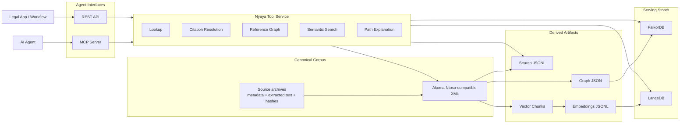
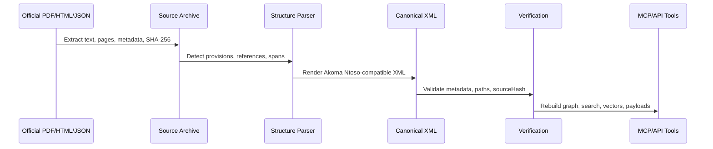

<p align="center">
  
  
  
  
  
</p>

<h1 align="center">Nyaya Ledger</h1>

<p align="center">
  <strong>Open Indian legal infrastructure for AI agents.</strong>
</p>

<p align="center">
  MCP tools, legal knowledge graphs, citation resolution, semantic search, and source-verifiable statutory text.
</p>

---

## The Pivot

Legal AI is moving from chat over documents to agentic systems that can use
tools, traverse knowledge, cite authority, and execute workflows. The missing
piece for India is not another chatbot. It is a reliable legal infrastructure
layer that agents can call.

Nyaya Ledger is that layer.

It converts Indian legal sources into a canonical, source-verifiable corpus and
serves that corpus through MCP and REST tools. Agents can resolve citations,
fetch exact statutory text, follow cross-references, trace rules back to Acts,
search semantically, and explain why provisions are connected.

This project is designed to be the open substrate beneath Indian legal agents,
research tools, compliance systems, tax workflows, and future legal knowledge
products.

```text
Legal AI agent
  -> Nyaya Ledger MCP
      -> exact provision text
      -> citation resolver
      -> graph traversal
      -> semantic search
      -> source provenance
      -> Indian statutory corpus
```

The thesis is simple: legal AI becomes useful when it is connected to
structured legal authority, not when it guesses over PDFs.

---

## What Agents Can Do

Nyaya Ledger gives an agent legal primitives instead of raw files.

| Need | Tooling |
|---|---|
| Find the exact text of a provision | `lookup_provision` |
| Turn `section 128A CGST Act` into a canonical ID | `resolve_citation` |
| Search provisions by legal meaning | `semantic_search` |
| Find who cites a provision | `get_incoming_refs` |
| Find what a provision cites | `get_outgoing_refs` |
| Trace a GST rule or form to its enabling Act section | `trace_rule_to_act` |
| Find related provisions across graph and vectors | `find_related_provisions` |
| Explain why two provisions are connected | `explain_reference_path` |
| Find forms prescribed under a rule | `get_forms_for_rule` |
| Compare amended versions over time | `compare_versions` roadmap |

Example workflows:

```text
FORM GST REG-06
  -> incoming references
  -> CGST Rule 10
  -> CGST Act section 25
  -> exact source-backed text
```

```text
Income-tax Act section 112A
  -> exact text
  -> outgoing references
  -> related provisions
  -> semantically similar capital-gains rules
```

---

## MCP First

The primary interface is an MCP server for local and hosted agents.

```bash
pip install -r requirements.txt

# Local agent clients
python3 scripts/serve_mcp.py

# Streamable HTTP MCP
python3 scripts/serve_mcp.py --transport streamable-http --host 127.0.0.1 --port 8090
```

The same tool layer is also available over FastAPI:

```bash
python3 scripts/serve_api.py --host 127.0.0.1 --port 8080
```

Example REST call:

```bash
curl http://127.0.0.1:8080/tools/resolve_citation \
  -H 'Content-Type: application/json' \
  -d '{"citation":"section 128A CGST Act"}'
```

The MCP and REST servers share the same service implementation, so agent
clients, web apps, internal services, and evaluation harnesses all hit the same
legal tool surface.

---

## Why This Matters

Indian law is highly connected. A single legal answer may require a statute,
rules, forms, notifications, amendments, schedules, and cross-references across
multiple Acts.

Most legal AI systems hide this complexity inside a closed product. Nyaya
Ledger makes the legal substrate open, inspectable, and self-hostable.

The project is built around four principles:

1. **Authority before fluency.** The corpus and graph are the grounding layer;
   LLMs reason over retrieved legal structure.
2. **Canonical IDs everywhere.** Provisions are addressable and composable
   across tools.
3. **Source-verifiable text.** XML nodes carry source spans and hashes.
4. **Rebuildable infrastructure.** Graphs, vectors, search indexes, and APIs
   are derived from the corpus, not hand-maintained.

---

## Architecture



XML is the source of truth. FalkorDB, LanceDB, JSONL search, embeddings, API
payloads, and HTML browsers are serving artifacts.

---

## Corpus Snapshot

| Metric | Value |
|---|---:|
| XML documents | 1,657 |
| Source archives | 1,548 |
| Provisions: sections, rules, forms, appendices | 14,591 |
| Cross-reference edges | 36,937 |
| Search records | 14,594 |
| Vector chunks | 97,052 |
| Embedding records | 97,052 |
| Acts ingested | 137 |
| CBIC notifications | 1,216 |

Coverage currently includes:

| Domain | Instruments |
|---|---|
| Direct tax | Income-tax Act 1961, Income-tax Act 2025, Income-tax Rules 2026, Wealth-tax Act, Gift-tax Act |
| GST and indirect tax | CGST Act, IGST Act, CGST Rules, Customs Tariff Act, CBIC notifications |
| Criminal law | BNS 2023, BNSS 2023, BSA 2023, IPC, CrPC, PMLA |
| Corporate and securities | Companies Act 2013, LLP Act, Competition Act, SEBI Act, SARFAESI Act |
| IP | Patents Act 1970, Copyright Act 1957, Trade Marks Act 1999, Designs Act 2000 |
| Civil and property | Indian Contract Act, Transfer of Property Act, Registration Act, Specific Relief Act |
| Labour | Industrial Disputes Act, EPF Act, ESIC Act, Payment of Wages Act, Maternity Benefit Act |
| Digital and identity | IT Act 2000, DPDP Act 2023, Aadhaar Act 2016 |

---

## Canonical IDs

Agents need stable handles. Nyaya Ledger uses canonical IDs for documents and
provisions:

```text
/in/union/acts/income-tax-act-1961/section/112a
/in/union/acts/cgst-act-2017/section/128a
/in/union/rules/cgst-rules-2017/rule/10/subrule/1
/in/union/forms/gst-reg-06
/in/union/notifications/cbic/central-tax/2025/18-2025
```

Legacy prototype IDs such as `CGST_Rules/Rule_10/SubRule_1` are normalized
where possible.

---

## Source Provenance

Every provision can be traced back to source text.

```xml
<section eId="section_112a"
         refersTo="/in/union/acts/income-tax-act-1961/section/112a"
         sourceStart="48912"
         sourceEnd="49301"
         sourceHash="a1b2c3d4..."
         sourceNodeType="section"
         sourceConfidence="0.9">
  <num>112A</num>
  <content>
    <p>Section 112A. Tax on long term capital gains.</p>
  </content>
</section>
```

`sourceHash` is computed over the extracted text span. That lets downstream
tools audit an answer back to the archived government PDF, portal HTML, or
scraped source record.

---

## Quick Start

```bash
git clone https://github.com/shikharpant/nyaya-ledger.git
cd nyaya-ledger
pip install -r requirements.txt
cp .env.example .env
```

Run the agent interface:

```bash
python3 scripts/serve_mcp.py
```

Run the HTTP interface:

```bash
python3 scripts/serve_api.py --host 127.0.0.1 --port 8080
```

The public repository tracks the code, schemas, docs, scripts, tests, and
infrastructure. Large generated artifacts such as `data/`, `sources/`,
`corpus/`, and `derived/` are local or separately published artifacts.

---

## Build the Serving Layer

```bash
# Start graph database
docker compose up -d falkordb

# Rebuild derived artifacts
python3 main.py graph rebuild
python3 main.py search rebuild
python3 main.py vector chunks

# Load graph into FalkorDB
python3 scripts/load_graph_falkordb.py --clear

# Generate embeddings with an OpenAI-compatible local endpoint
python3 scripts/embed_vector_chunks.py \
  --endpoint http://127.0.0.1:1234/v1 \
  --model text-embedding-nomic-embed-text-v1.5

# Build LanceDB semantic index
python3 scripts/build_lancedb_index.py --overwrite
```

Validated local serving artifacts:

| Artifact | Location |
|---|---|
| FalkorDB graph | `127.0.0.1:6379`, graph `nyaya_ledger` |
| FalkorDB UI | `http://127.0.0.1:3010` |
| LanceDB table | `derived/vector/lancedb`, table `nyaya_ledger_nomic_v1_5` |
| Graph JSON | `derived/graph/corpus_graph.json` |
| Search JSONL | `derived/search/corpus_search.jsonl` |
| Embeddings JSONL | `derived/vector/embeddings.nomic-v1.5.jsonl` |

---

## Pipeline

The ingestion pipeline turns official legal sources into agent-ready legal
infrastructure.



Core commands:

```bash
python3 main.py pipeline verify
python3 main.py graph rebuild
python3 main.py search rebuild
python3 main.py vector chunks
python3 main.py api export
python3 main.py html build
```

Tests:

```bash
python3 -m pytest tests/test_canonical_corpus.py -q
make verify
```

---

## Ingesting Law

```bash
python3 scripts/ingest_it_act.py
python3 scripts/ingest_it_act_2025.py
python3 scripts/ingest_it_rules_2026.py
```

Generic ingestion:

```bash
python3 main.py corpus ingest path/to/act.pdf \
  sources/in/union/acts/my-act \
  corpus/in/union/acts/my-act/act.xml \
  --canonical-id /in/union/acts/my-act \
  --document-type act \
  --title "My Act, 2026" \
  --mode deterministic
```

Deterministic parsing is preferred for production corpus work. LLM-assisted
parsing can help with difficult sources, but source-span validation remains the
quality gate.

---

## Future Map

### 1. Public Agent Substrate

Make Nyaya Ledger easy for any local or hosted agent to consume:

- hosted MCP endpoint
- versioned corpus artifact releases
- Docker Compose profile for agent stacks
- SearXNG and Firecrawl companion tools
- legal-agent prompt packs and workflow examples

### 2. Better Legal Intelligence

Move beyond retrieval into legal structure:

- richer citation resolution across Indian legal abbreviations and naming
  variants
- provision-level confidence and coverage reports
- graph-based issue maps for tax, GST, company law, and criminal law
- semantic + graph hybrid related-provision ranking
- legal query evals for citation, lookup, graph path, and retrieval quality

### 3. Time-Travel Law

Materialize amended law over time:

- provision version graph
- `compare_versions`
- amendment impact reports
- notification-to-corpus mutation plans
- as-of-date lookup for statutory text

### 4. Legal Products on Top

Build thin products over the infrastructure:

- Indian legal graph explorer
- GST form/rule/Act tracing assistant
- direct tax research assistant
- notification impact monitor
- compliance workflow agent
- private corpus connector for firms and teams

### 5. Open Legal Data Layer

Keep the core open and inspectable:

- source manifests for official legal material
- reproducible corpus builds
- signed or hashed corpus releases
- public unresolved-reference reports
- contribution workflow for jurisdiction modules

---

## Project Structure

```text
nyaya-ledger/
├── main.py
├── src/
│   ├── legal_corpus/
│   │   ├── serving.py          # Shared MCP/REST tool service
│   │   ├── graph_index.py      # Graph artifact builder
│   │   ├── search_index.py     # Search artifact builder
│   │   ├── vector_index.py     # RAG chunk builder
│   │   ├── source_archive.py   # Source extraction and archive checks
│   │   ├── renderer.py         # Akoma Ntoso-compatible XML rendering
│   │   └── validator.py        # Corpus and sourceHash validation
│   └── schemas/
├── scripts/
│   ├── serve_mcp.py
│   ├── serve_api.py
│   ├── load_graph_falkordb.py
│   ├── build_lancedb_index.py
│   ├── embed_vector_chunks.py
│   └── ingest_*.py
├── tests/
├── docs/
├── pipeline/
├── docker-compose.yml
├── requirements.txt
└── LICENSE
```

Local generated directories:

| Directory | Purpose |
|---|---|
| `data/` | Raw PDFs, scraped JSON, source downloads |
| `sources/` | Extracted text, metadata, checksums |
| `corpus/` | Canonical XML corpus |
| `derived/` | Graph, search, vectors, embeddings, API, HTML, LanceDB |

---

## Status

Implemented:

- MCP server and REST API over a shared legal tool service
- canonical provision lookup and legacy ID normalization
- citation resolution for common Indian legal references
- graph traversal through FalkorDB with graph JSON fallback
- semantic search through LanceDB
- GST form/rule/Act tracing
- rebuildable graph, search, vector, API, and HTML artifacts
- source-hash validation and pipeline verification

---

## License

MIT License. See [LICENSE](LICENSE).

---

## Acknowledgements

- Akoma Ntoso for legislative XML conventions
- Government of India public legal sources, including Income Tax Department,
  CBIC, and India Code
- Built with Python, Pydantic, FastAPI, MCP, FalkorDB, LanceDB, and Rich
