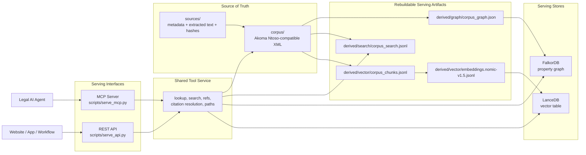
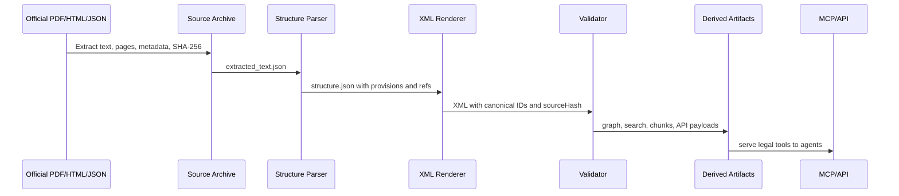

<p align="center">
  
  
  
  
  
</p>

<h1 align="center">Nyaya Ledger</h1>

<p align="center">
  <strong>Agent-ready Indian legal infrastructure over statutes, rules, forms, notifications, knowledge graphs, and semantic search.</strong>
</p>

<p align="center">
  MCP tools + REST API + Akoma Ntoso-compatible XML + FalkorDB graph + LanceDB vectors.
</p>

---

## What This Is

Nyaya Ledger is an open-source infrastructure layer for Indian legal AI agents.
It turns Indian legal source material into a canonical XML corpus, rebuildable
graph/vector artifacts, and an MCP server that agents can call directly.

The goal is not just to store legal text. The goal is to let an agent answer
operational legal questions with traceable structure:

- What is the exact text of a section, rule, form, or notification?
- Who cites this provision?
- What does this provision cite?
- Which Act section enables this rule or form?
- How are two provisions connected in the legal graph?
- What related provisions should be reviewed together?
- Which corpus span and source hash support this answer?

Nyaya Ledger currently focuses on Indian Union law, with strong coverage across
tax, GST, criminal law, company law, IP, civil law, labour law, and regulatory
statutes.

---

## MCP First

The primary downstream interface is an MCP server for legal agents.

```bash
# Install dependencies
pip install -r requirements.txt

# Start the MCP server over stdio for local agent clients
python3 scripts/serve_mcp.py

# Optional: expose MCP over streamable HTTP
python3 scripts/serve_mcp.py --transport streamable-http --host 127.0.0.1 --port 8090
```

The MCP tools are backed by the canonical XML corpus, FalkorDB graph serving
index, LanceDB semantic index, and JSON/JSONL rebuildable artifacts.

| MCP Tool | What It Does | Backing Layer |
|---|---|---|
| `lookup_provision` | Fetch exact text, metadata, path, refs, and provenance for a section, rule, form, notification, or document | XML corpus |
| `semantic_search` | Search Indian legal provisions by meaning | LanceDB + local embedding endpoint |
| `resolve_citation` | Convert citations like `section 128A CGST Act` into canonical IDs | XML corpus + lexical search |
| `get_incoming_refs` | Find provisions that cite a given provision | FalkorDB or graph JSON fallback |
| `get_outgoing_refs` | Find provisions cited by a given provision | FalkorDB or graph JSON fallback |
| `trace_rule_to_act` | Trace a rule/form/notification back to enabling Act sections | FalkorDB or graph JSON fallback |
| `find_related_provisions` | Combine graph neighbors and semantic neighbors | FalkorDB + LanceDB |
| `explain_reference_path` | Show why two provisions are connected | FalkorDB or graph JSON fallback |
| `get_forms_for_rule` | Find forms prescribed or referenced by a rule | FalkorDB or graph JSON fallback |
| `compare_versions` | Future: compare amended provision states over time | Planned time-travel corpus |

### REST API

The same tool service is exposed through FastAPI for websites, dashboards,
internal services, and non-MCP clients.

```bash
python3 scripts/serve_api.py --host 127.0.0.1 --port 8080
```

Example:

```bash
curl http://127.0.0.1:8080/tools/resolve_citation \
  -H 'Content-Type: application/json' \
  -d '{"citation":"section 128A CGST Act"}'
```

REST tools are available as `POST /tools/<tool_name>`. API docs are available
from FastAPI at `/docs` when the server is running.

---

## Architecture



Design rule: XML is authoritative. Databases, vectors, search indexes, and API
payloads are serving artifacts that can be rebuilt.

---

## Current Corpus

| Metric | Value |
|---|---:|
| XML documents | 1,657 |
| Source archives | 1,548 |
| Provisions: sections, rules, forms, appendices | 14,591 |
| Cross-reference edges | 36,937 |
| Search records | 14,594 |
| Vector chunks | 97,052 |
| Nomic embedding records | 97,052 |
| Acts ingested | 137 |
| CBIC notifications | 1,216 |

### Legal Coverage

| Domain | Key Instruments |
|---|---|
| Direct Tax | Income-tax Act 1961, Income-tax Act 2025, Income-tax Rules 2026, Wealth-tax Act, Gift-tax Act |
| Indirect Tax | CGST Act, IGST Act, CGST Rules, Customs Tariff Act, CBIC notifications |
| Criminal Law | Bharatiya Nyaya Sanhita 2023, BNSS 2023, BSA 2023, IPC, CrPC, PMLA |
| Corporate and Securities | Companies Act 2013, LLP Act, Competition Act, SEBI Act, SARFAESI Act |
| IP | Patents Act 1970, Copyright Act 1957, Trade Marks Act 1999, Designs Act 2000 |
| Civil and Property | Indian Contract Act, Transfer of Property Act, Registration Act, Specific Relief Act |
| Labour | Industrial Disputes Act, EPF Act, ESIC Act, Payment of Wages Act, Maternity Benefit Act |
| Digital and Identity | IT Act 2000, Digital Personal Data Protection Act 2023, Aadhaar Act 2016 |

---

## Quick Start

```bash
git clone https://github.com/shikharpant/nyaya-ledger.git
cd nyaya-ledger
pip install -r requirements.txt
```

The public GitHub repo tracks code, schemas, docs, scripts, and tests. Large
local artifacts such as `data/`, `sources/`, `corpus/`, and `derived/` are
generated or distributed separately.

To run against a local corpus:

```bash
# Optional: copy defaults and edit paths/endpoints
cp .env.example .env

# Run MCP for agent clients
python3 scripts/serve_mcp.py

# Run REST for HTTP clients
python3 scripts/serve_api.py --host 127.0.0.1 --port 8080
```

---

## Build Serving Stores

FalkorDB provides graph traversal. LanceDB provides semantic search. Both are
optional at runtime because the service can fall back to XML, search JSONL, and
graph JSON for many tools.

```bash
# Start FalkorDB
docker compose up -d falkordb

# Build graph JSON from XML
python3 main.py graph rebuild

# Load graph JSON into FalkorDB
python3 scripts/load_graph_falkordb.py --clear

# Build full-text search records
python3 main.py search rebuild

# Build vector chunks
python3 main.py vector chunks

# Generate embeddings through an OpenAI-compatible local endpoint
python3 scripts/embed_vector_chunks.py \
  --endpoint http://127.0.0.1:1234/v1 \
  --model text-embedding-nomic-embed-text-v1.5

# Build LanceDB table
python3 scripts/build_lancedb_index.py --overwrite
```

Validated local serving artifacts:

| Artifact | Location |
|---|---|
| FalkorDB graph | `127.0.0.1:6379`, graph `nyaya_ledger` |
| FalkorDB UI | `http://127.0.0.1:3010` |
| LanceDB table | `derived/vector/lancedb`, table `nyaya_ledger_nomic_v1_5` |
| Graph JSON | `derived/graph/corpus_graph.json` |
| Search JSONL | `derived/search/corpus_search.jsonl` |
| Embeddings JSONL | `derived/vector/embeddings.nomic-v1.5.jsonl` |

Environment variables are documented in [.env.example](.env.example).

---

## Canonical IDs

Nyaya Ledger uses stable canonical IDs so agents can pass references between
tools without ambiguity.

```text
/in/union/acts/income-tax-act-1961/section/112a
/in/union/acts/cgst-act-2017/section/128a
/in/union/rules/cgst-rules-2017/rule/10/subrule/1
/in/union/forms/gst-reg-06
/in/union/notifications/cbic/central-tax/2025/18-2025
```

Legacy prototype IDs such as `CGST_Rules/Rule_10/SubRule_1` are normalized by
the lookup layer where possible.

---

## Source Provenance

Every XML provision carries source-span metadata:

```xml
<section eId="section_112a"
         refersTo="/in/union/acts/income-tax-act-1961/section/112a"
         sourceStart="48912"
         sourceEnd="49301"
         sourceHash="a1b2c3d4..."
         sourceNodeType="section"
         sourceConfidence="0.9">
  <num>112A</num>
  <content>
    <p>Section 112A. Tax on long term capital gains.</p>
  </content>
</section>
```

`sourceHash` is computed over the exact extracted source-text span. This lets a
tool response be audited back to the government PDF, portal HTML, or scraped
source archive that produced it.

---

## Pipeline

The ingestion pipeline converts official source material into a corpus that
agents can query safely.



Core commands:

```bash
python3 main.py pipeline verify      # Full verification gate
python3 main.py graph rebuild        # Knowledge graph JSON
python3 main.py search rebuild       # Search index JSONL
python3 main.py vector chunks        # RAG chunk JSONL
python3 main.py api export           # API payload JSON
python3 main.py html build           # Static HTML browser
```

Tests:

```bash
python3 -m pytest tests/test_canonical_corpus.py -q
make verify
```

---

## Ingesting Law

From a scraped JSON:

```bash
python3 scripts/ingest_it_act.py
python3 scripts/ingest_it_act_2025.py
python3 scripts/ingest_it_rules_2026.py
```

From a source PDF or text file:

```bash
python3 main.py corpus ingest path/to/act.pdf \
  sources/in/union/acts/my-act \
  corpus/in/union/acts/my-act/act.xml \
  --canonical-id /in/union/acts/my-act \
  --document-type act \
  --title "My Act, 2026" \
  --mode deterministic
```

The deterministic parser is preferred for production corpus work. Optional LLM
parsing exists for hard extraction cases, but source-span validation remains the
quality gate.

---

## Example Agent Workflows

### Trace a GST Form to Its Legal Authority

1. `resolve_citation("FORM GST REG-06")`
2. `get_incoming_refs("/in/union/forms/gst-reg-06")`
3. `trace_rule_to_act("/in/union/rules/cgst-rules-2017/rule/10/subrule/1")`
4. `lookup_provision("/in/union/acts/cgst-act-2017/section/25")`

### Review a Direct Tax Issue

1. `semantic_search("long term capital gains on listed equity shares")`
2. `lookup_provision("/in/union/acts/income-tax-act-1961/section/112a")`
3. `get_outgoing_refs("/in/union/acts/income-tax-act-1961/section/112a")`
4. `find_related_provisions("/in/union/acts/income-tax-act-1961/section/112a")`

### Explain a Connection

1. `resolve_citation("section 164 CGST Act")`
2. `resolve_citation("rule 10 CGST Rules")`
3. `explain_reference_path(rule_id, section_id)`

---

## Project Structure

```text
nyaya-ledger/
├── main.py
├── src/
│   ├── legal_corpus/
│   │   ├── serving.py          # Shared MCP/REST tool service
│   │   ├── graph_index.py      # Graph artifact builder
│   │   ├── search_index.py     # Search artifact builder
│   │   ├── vector_index.py     # RAG chunk builder
│   │   ├── source_archive.py   # Source extraction and archive checks
│   │   ├── renderer.py         # Akoma Ntoso-compatible XML rendering
│   │   └── validator.py        # Corpus and sourceHash validation
│   └── schemas/
├── scripts/
│   ├── serve_mcp.py            # MCP server
│   ├── serve_api.py            # FastAPI server
│   ├── load_graph_falkordb.py
│   ├── build_lancedb_index.py
│   ├── embed_vector_chunks.py
│   └── ingest_*.py
├── tests/
├── docs/
├── pipeline/
├── docker-compose.yml
├── requirements.txt
└── LICENSE
```

Local-only generated directories:

| Directory | Purpose |
|---|---|
| `data/` | Raw PDFs, scraped JSON, source downloads |
| `sources/` | Extracted text, metadata, checksums |
| `corpus/` | Canonical XML corpus |
| `derived/` | Graph, search, vector, embeddings, API, HTML, LanceDB |

---

## Status and Roadmap

Already implemented:

- MCP server and REST API over the same shared tool service
- XML provision lookup with canonical IDs and legacy ID normalization
- Citation resolution for common Indian law references
- Graph traversal through FalkorDB with JSON fallback
- Semantic search through LanceDB and local OpenAI-compatible embeddings
- GST form/rule/Act tracing
- Rebuildable graph, search, vector, API, and HTML artifacts
- Corpus verification and source-hash validation

Next priorities:

- Materialize amendment history for `compare_versions`
- Publish corpus artifacts separately from the code repository
- Add hosted MCP/REST deployment for public corpus access
- Extend citation resolution across more Indian law naming variants
- Improve unresolved-reference closure for GST, Income-tax, and base-law edge cases

---

## License

MIT License. See [LICENSE](LICENSE).

---

## Acknowledgements

- Akoma Ntoso for legislative XML conventions
- Government of India public legal sources, including Income Tax Department,
  CBIC, and India Code
- Built with Python, Pydantic, FastAPI, MCP, FalkorDB, LanceDB, and Rich
