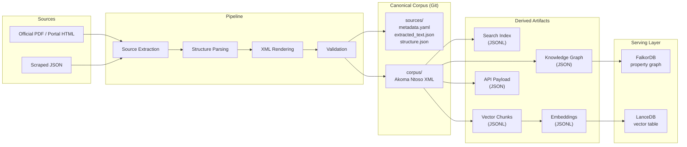
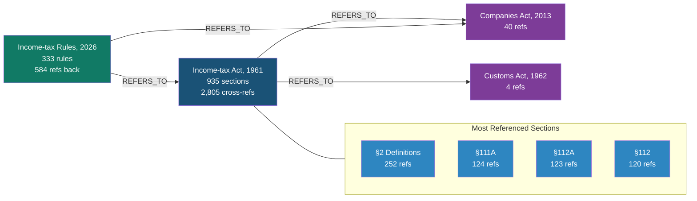
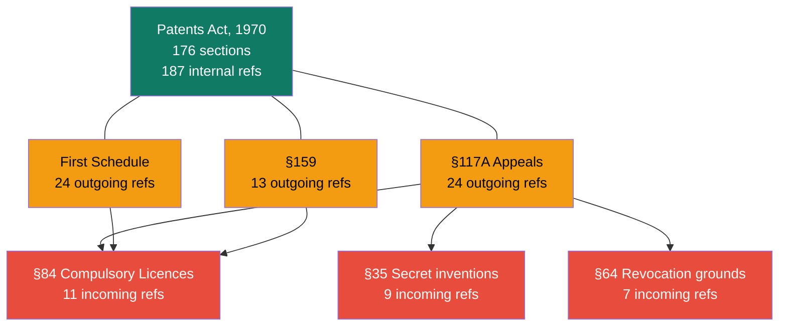
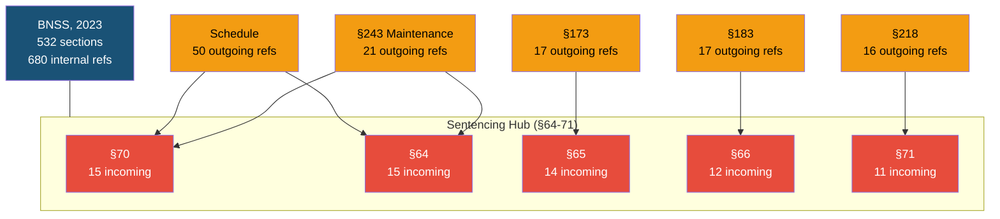
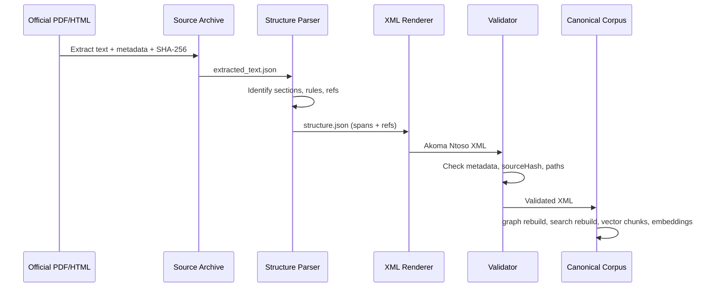

<p align="center">
  
  
  
  
</p>

<h1 align="center">Nyaya Ledger</h1>

<p align="center">
  <strong>An open-source legal data pipeline that converts Indian legislation into structured, versionable, and queryable knowledge graphs.</strong>
</p>

<p align="center">
  <em>Nyaya</em> (Sanskrit: न्याय) &mdash; justice, logic, method.
</p>

---

## Why This Exists

Indian law lives in PDFs, gazette notifications, and fragmented government
portals. A practicing chartered accountant who wants to trace why Section 112A
of the Income-tax Act says what it says &mdash; which Finance Act inserted it,
which notification amended it, which rule operationalises it &mdash; has no
single machine-readable source.

**Nyaya Ledger** solves this by turning Indian legal documents into:

| Output | What it is |
|---|---|
| **Akoma Ntoso XML** | Machine-readable legal text with per-provision source provenance |
| **Knowledge Graph** | Cross-references between sections, rules, forms, and notifications |
| **Search Index** | Full-text JSONL index ready for BM25 / vector search |
| **Vector Chunks** | RAG-ready chunked text for embedding pipelines |
| **Serving Stores** | FalkorDB property graph and LanceDB vector table for MCP/API tools |

Every provision carries a `sourceHash` &mdash; a SHA-256 computed over the
exact source-text span &mdash; so the XML can be independently audited against
the original government document.

---

## Architecture



### Design Principles

1. **Git is the canonical history.** Databases and indexes are rebuildable
   derived artifacts. `corpus/` is the single source of truth.
2. **Deterministic parsing.** The same PDF always produces the same XML. No LLM
   is required for the core pipeline (one is available as an optional parser
   mode).
3. **Source provenance on every node.** Each XML element carries `sourceStart`,
   `sourceEnd`, and `sourceHash` so you can trace any provision back to the
   exact bytes of the original government document.
4. **Cross-reference graph.** The pipeline extracts `section`, `rule`, and
   `form` references and builds a navigable knowledge graph with `CONTAINS` and
   `REFERS_TO` edges.

---

## Corpus at a Glance

| Metric | Value |
|---|---|
| XML documents | **1,657** |
| Source archives | **1,548** |
| Provisions (sections, rules, forms, appendices) | **14,591** |
| Cross-reference edges | **36,937** |
| Search records | **14,594** |
| RAG-ready vector chunks | **97,052** |
| Nomic embedding records | **97,052** |
| Acts ingested | **137** |
| CBIC notifications | **1,216** |

### Legal Coverage

The corpus currently covers **130+ Indian statutes** across tax, criminal,
corporate, IP, civil, labour, and regulatory law, including:

| Domain | Key Instruments |
|---|---|
| **Direct Tax** | Income-tax Act 1961 (935 sections), Income-tax Act 2025 (553 sections), Income-tax Rules 2026 (333 rules, appendices, and 190 forms), Wealth-tax Act, Gift-tax Act |
| **Indirect Tax** | CGST Act, IGST Act, CGST Rules, Customs Tariff Act, 1,216 CBIC notifications |
| **Criminal Law** | Bharatiya Nyaya Sanhita 2023, BNSS 2023, BSA 2023, Indian Penal Code, CrPC 1973, PMLA |
| **Corporate** | Companies Act 2013, LLP Act, Competition Act, SEBI Act, SARFAESI Act |
| **IP** | Patents Act 1970, Copyright Act 1957, Trade Marks Act 1999, Designs Act 2000 |
| **Civil & Property** | Indian Contract Act, Transfer of Property Act, Registration Act, Specific Relief Act |
| **Labour** | Industrial Disputes Act, EPF Act, ESIC Act, Payment of Wages Act, Maternity Benefit Act |
| **Digital** | IT Act 2000, Digital Personal Data Protection Act 2023, Aadhaar Act 2016 |

---

## Knowledge Graph Snapshots

### Income-tax Act, 1961 &mdash; Cross-Reference Graph

The Income-tax Act is the most interconnected statute in the corpus. Its 935
sections carry **2,805 cross-references** internally and to other acts,
including 40 references to the Companies Act and 4 to the Customs Act. The
Income-tax Rules, 2026 add **584 references back** to IT Act sections.



### Patents Act, 1970 &mdash; Internal Reference Map

The Patents Act has 176 sections with **187 internal cross-references**. The
most-referenced provision is §84 (compulsory licences), followed by §35 and
§64. Section 117A (appeals) and the First Schedule are the most prolific
referrers.



### Bharatiya Nagarik Suraksha Sanhita, 2023 &mdash; Hub Analysis

India's new criminal procedure code has 532 sections with **680 internal
cross-references**. Sections 64&ndash;71 (sentencing and punishment limits) form
the most-referenced hub cluster. §243 (maintenance of wives and children) is
the single most prolific referrer.



---

## Source Provenance

Every XML element carries cryptographic proof of origin:

```xml
<section eId="section_112a"
         refersTo="/in/union/acts/income-tax-act-1961/section/112a"
         sourceStart="48912"
         sourceEnd="49301"
         sourceHash="a1b2c3d4..."
         sourceNodeType="section"
         sourceConfidence="0.9">
  <num>112A</num>
  <content>
    <p>* Section 112A. Tax on long term capital gains.-</p>
    <paragraph eId="section_112a__para_1"
               sourceStart="49302" sourceEnd="49650"
               sourceHash="e5f6a7b8..."
               sourceNodeType="paragraph">
      <content>
        <p>(1) Notwithstanding anything contained in ...</p>
      </content>
      <references>
        <ref eId="section_112a__para_1__ref_1"
             href="/in/union/acts/income-tax-act-1961/section/112"
             showAs="/in/union/acts/income-tax-act-1961/section/112"
             type="REFERS_TO"/>
      </references>
    </paragraph>
  </content>
</section>
```

The `sourceHash` is `sha256(extracted_text["text"][sourceStart:sourceEnd])` &mdash;
verifiable against the archived source extraction.

---

## Quick Start

```bash
# Clone
git clone https://github.com/shikharpant/git-for-law.git
cd git-for-law

# Install
pip install -r requirements.txt

# Run tests
make test

# Full verification gate (tests + compile + pipeline + whitespace check)
make verify
```

### Ingesting New Legislation

```bash
# From a scraped JSON (e.g., from incometaxindia.gov.in)
python3 scripts/ingest_it_act.py

# From a PDF source
python3 main.py corpus ingest path/to/act.pdf \
  sources/in/union/acts/my-act \
  corpus/in/union/acts/my-act/act.xml \
  --canonical-id /in/union/acts/my-act \
  --document-type act \
  --title "My Act, 2026" \
  --mode deterministic
```

### Querying the Corpus

```bash
# List all acts
python3 main.py corpus list --type act

# Query a specific provision
python3 main.py corpus query /in/union/acts/income-tax-act-1961/section/112a

# Full-text search
python3 main.py search query "capital gains tax"

# Export provision text
python3 main.py corpus export-text /in/union/acts/patents-act-1970/section/84
```

### Building Derived Artifacts

```bash
python3 main.py graph rebuild        # Knowledge graph JSON
python3 main.py search rebuild       # Search index JSONL
python3 main.py vector chunks        # RAG-ready chunks JSONL
python3 main.py api export           # API payload JSON
python3 main.py html build           # Static HTML browser
python3 main.py pipeline verify      # Full verification gate
```

### Serving Layer

The canonical corpus remains XML and JSONL. FalkorDB and LanceDB are serving
stores built from derived artifacts for MCP tools, APIs, GraphRAG, and semantic
search.

```bash
# Start FalkorDB graph database
docker compose up -d falkordb

# Load the property graph from derived/graph/corpus_graph.json
python3 scripts/load_graph_falkordb.py --clear

# Generate embeddings with a local OpenAI-compatible embedding endpoint
python3 scripts/embed_vector_chunks.py \
  --endpoint http://127.0.0.1:1234/v1 \
  --model text-embedding-nomic-embed-text-v1.5

# Build the LanceDB vector table
python3 scripts/build_lancedb_index.py --overwrite

# Run the REST API
python3 scripts/serve_api.py --host 127.0.0.1 --port 8080

# Or run the MCP server over stdio for local agent clients
python3 scripts/serve_mcp.py
```

Validated local serving artifacts:

| Store | Location / Endpoint | Contents |
|---|---|---|
| FalkorDB | `127.0.0.1:6379`, graph `nyaya_ledger` | 14,591 corpus nodes plus unresolved-reference placeholders |
| FalkorDB UI | `http://127.0.0.1:3010` | Optional browser UI |
| LanceDB | `derived/vector/lancedb`, table `nyaya_ledger_nomic_v1_5` | 97,052 vectors, 768 dimensions |
| Embeddings JSONL | `derived/vector/embeddings.nomic-v1.5.jsonl` | Portable embedding artifact, 1.6 GB |

Implemented tools over this serving layer:

| Tool | Backing Store |
|---|---|
| `lookup_provision` | XML corpus or FalkorDB |
| `resolve_citation` | XML corpus + search JSONL |
| `get_incoming_refs` / `get_outgoing_refs` | FalkorDB |
| `trace_rule_to_act` | FalkorDB |
| `get_forms_for_rule` | FalkorDB |
| `explain_reference_path` | FalkorDB |
| `find_related_provisions` | FalkorDB + LanceDB |
| `semantic_search` | LanceDB |
| `compare_versions` | Placeholder until amended states are materialized |

REST tools are exposed as `POST /tools/<tool_name>`, for example:

```bash
curl http://127.0.0.1:8080/tools/resolve_citation \
  -H 'Content-Type: application/json' \
  -d '{"citation":"section 128A CGST Act"}'
```

The MCP server can also be run over HTTP for remote clients:

```bash
python3 scripts/serve_mcp.py --transport streamable-http --host 127.0.0.1 --port 8090
```

Note: the FalkorDB loader merges identical `source -> relationship type ->
target` edges for serving traversal. If every repeated reference occurrence must
be preserved as a separate edge, include `eId` in the relationship identity.

---

## Project Structure

```
git-for-law/
├── main.py                    # CLI entry point (40+ commands)
├── src/
│   ├── legal_corpus/           # Core pipeline modules
│   │   ├── source_archive.py   # Immutable source archiving
│   │   ├── structure_parser.py # Deterministic structure parsing
│   │   ├── renderer.py         # Akoma Ntoso XML rendering
│   │   ├── validator.py        # SourceHash verification
│   │   ├── graph_index.py      # Knowledge graph builder
│   │   ├── search_index.py     # Full-text search builder
│   │   ├── vector_index.py     # RAG chunk builder
│   │   ├── serving.py          # Shared REST/MCP tool service
│   │   └── ...                 # 24 modules total
│   ├── models.py               # Pydantic data models
│   └── schemas/                # JSON Schema definitions
├── scripts/                    # Ingestion and scraping scripts
│   ├── ingest_it_act.py        # IT Act 1961 ingestion
│   ├── ingest_it_act_2025.py   # IT Act 2025 ingestion
│   ├── ingest_it_rules_2026.py # IT Rules 2026 ingestion
│   ├── embed_vector_chunks.py  # OpenAI-compatible embedding export
│   ├── build_lancedb_index.py  # LanceDB vector table builder
│   ├── load_graph_falkordb.py  # FalkorDB graph loader
│   ├── serve_api.py            # FastAPI REST service
│   ├── serve_mcp.py            # MCP tool server
│   ├── bulk_ingest_acts.py     # Bulk act ingestion
│   └── ...                     # Scrapers, extractors, splitters
├── tests/
│   └── test_canonical_corpus.py # 54 tests
├── docs/
│   └── india_legal_profile.md  # Jurisdiction profile specification
├── pipeline/
│   └── README.md               # Pipeline command reference
├── .github/workflows/
│   └── verify.yml              # CI: test + compile + pipeline verify
├── Makefile                    # make verify, make test, make inventory
├── requirements.txt
├── docker-compose.yml          # FalkorDB + Neo4j services
└── LICENSE                     # MIT
```

**Local-only directories** (generated, not tracked in Git):

| Directory | Purpose |
|---|---|
| `data/` | Raw PDFs, scraped JSONs, government portal downloads |
| `sources/` | Extracted text + metadata + checksums per document |
| `corpus/` | Canonical Akoma Ntoso XML (1,657 files) |
| `derived/` | Rebuildable graph, search, vector, embeddings, API, HTML, LanceDB artifacts |

---

## How It Works

### 1. Source Extraction

Government PDFs and portal HTML are extracted into `extracted_text.json` with
page-level offsets. The SHA-256 of the source file is archived in
`metadata.yaml`.

### 2. Structure Parsing

A deterministic parser identifies provision boundaries (sections, rules,
subrules, provisos, explanations) using regex patterns tuned per document type.
Each boundary records `start`, `end`, `text_hash`, and `confidence`.

### 3. Cross-Reference Extraction

The parser scans provision text for references to other sections, rules, and
forms. References are resolved against a known-act map and emitted as
`REFERS_TO` edges with source-span provenance.

### 4. XML Rendering

Structure spans and references are rendered into Akoma Ntoso-compatible XML
with full `sourceStart` / `sourceEnd` / `sourceHash` provenance on every
element.

### 5. Validation

The validator checks:
- Required metadata fields (canonical_id, document_type, title, jurisdiction,
  etc.)
- `sourceHash` integrity against `extracted_text.json`
- Canonical ID to file-path mapping



---

## Time-Travel Queries

```bash
# Query a rule as of a specific date
python3 main.py query CGST_Rules/Rule_10 --as-of 2025-10-31

# Compare a rule at two dates
python3 main.py compare CGST_Rules/Rule_10 2025-10-31 2025-11-01
```

Amendments are applied as copy-on-write mutations with effective dates,
preserving the full history:

```
(Rule_10:v1) --[NEXT_VERSION {eff: 2025-11-01}]--> (Rule_10:v2)
```

---

## Amendment Pipeline

```bash
# Plan amendments from a notification
python3 main.py amendment plan sources/cbic/central-tax/2025/18-2025 \
  --output derived/amendments/plan.json

# Apply to a separate output corpus
python3 main.py amendment apply sources/cbic/central-tax/2025/18-2025 \
  --output-corpus derived/corpus-amended

# Diff against the canonical corpus
python3 main.py corpus diff derived/corpus-amended \
  --base-corpus corpus \
  --output derived/diffs/report.json
```

---

## Contributing

1. Fork the repository
2. Create a feature branch
3. Run `make verify` to ensure all tests pass
4. Submit a pull request

The CI pipeline (`.github/workflows/verify.yml`) runs tests, Python
compilation, and the full verification gate on every push.

---

## License

MIT License. See [LICENSE](LICENSE).

---

## Acknowledgements

- [Akoma Ntoso](http://www.akomantoso.org/) &mdash; XML standard for
  parliamentary and legislative documents
- Government of India &mdash; [Income Tax Department](https://www.incometaxindia.gov.in),
  [CBIC](https://www.cbic.gov.in) for publicly accessible legal texts
- Built with Python, Pydantic, FalkorDB, LanceDB, Neo4j, and Rich
