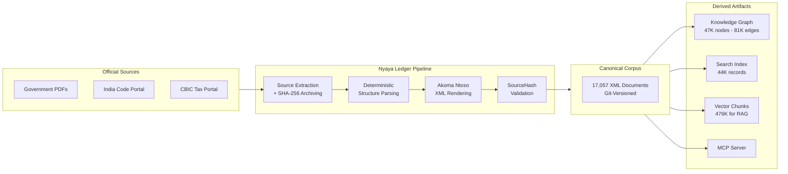
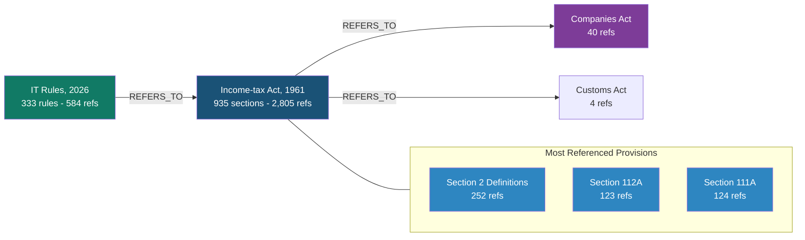
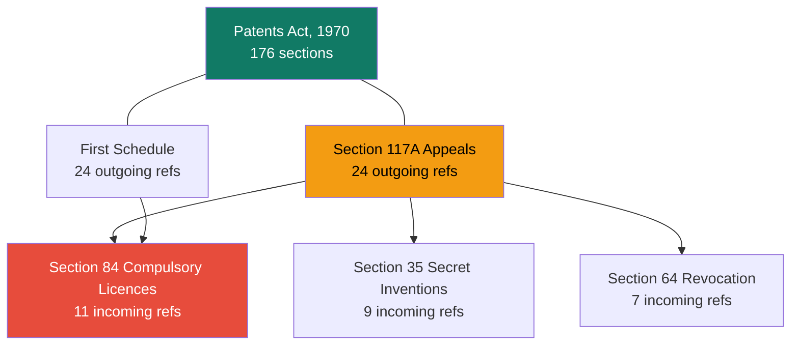
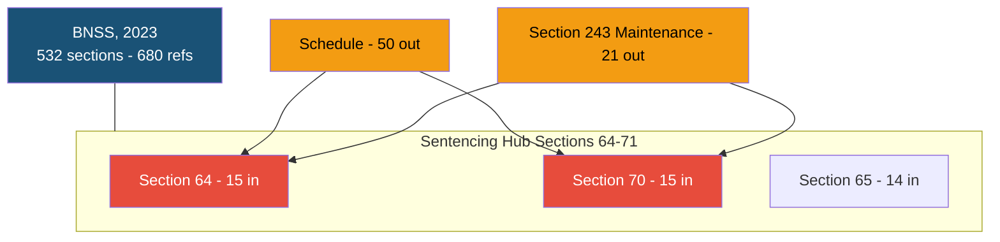
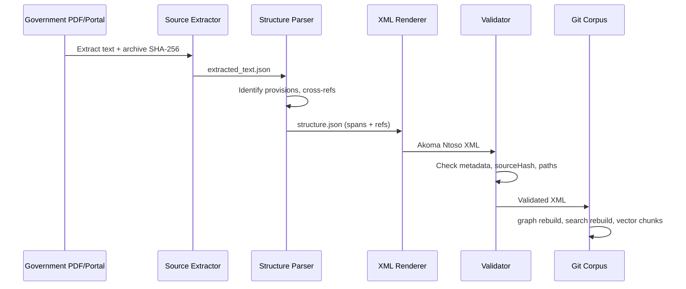

<p align="center">
  
  
  
  
  
  
</p>

<h1 align="center">Nyaya Ledger</h1>

<p align="center">
  <strong>Open-source legal infrastructure for India.</strong>
</p>

<p align="center">
  A deterministic pipeline that converts Indian legislation into structured, version-controlled,
  cryptographically-provenanced, cross-referenced, and queryable knowledge artifacts.
</p>

<p align="center">
  <em>Nyaya</em> (Sanskrit: न्याय) &mdash; justice, logic, method.
</p>

<p align="center">
  <a href="#quick-start">Quick Start</a> &middot;
  <a href="#corpus-at-a-glance">Corpus</a> &middot;
  <a href="#architecture">Architecture</a> &middot;
  <a href="#use-cases">Use Cases</a> &middot;
  <a href="#contributing">Contributing</a>
</p>

---

## The Problem

India's legal system produces thousands of pages of legislation each year across
hundreds of statutes, rules, notifications, and circulars. This material lives in
PDFs, scanned gazettes, and fragmented government portals with no unified
machine-readable source.

A chartered accountant tracing why Section 112A of the Income-tax Act says what
it says &mdash; which Finance Act inserted it, which notification amended it,
which rule operationalises it &mdash; must manually cross-reference dozens of
documents. A legal AI cannot answer that question because no structured data
exists.

**Nyaya Ledger** solves this.

---

## What It Does

Nyaya Ledger is a deterministic pipeline that converts Indian legal documents
into structured, provenance-tracked, cross-referenced knowledge artifacts:

| Output | Scale | Description |
|---|---|---|
| **Akoma Ntoso XML** | 17,057 documents | Per-provision legal text with cryptographic source provenance |
| **Knowledge Graph** | 81K edges / 47K nodes | Cross-reference network across 883 statutes and subordinate legislation |
| **Search Index** | 44K+ records | Full-text search over the entire corpus |
| **Vector Embeddings** | 476,722 chunks | RAG-ready text chunks (nomic-embed-text-v1.5, 768-dim) in LanceDB |
| **MCP Server** | Agent-native | Model Context Protocol interface for AI agent integration |
| **Source Archives** | 15,660 archives | Immutable source text with SHA-256 verification |

Every XML element carries a `sourceHash` (SHA-256 of the exact source-text
span), so any provision can be independently audited against the original
government document.

---

## Corpus at a Glance

| Metric | Value |
|---|---|
| **Central Acts** | 883 Acts of Parliament |
| **Schedules** | 661 across 317 Acts |
| **Notifications** | 11,326 CBIC notifications (Customs, GST, Excise, Service Tax, Anti-Dumping, CVD, Safeguards) |
| **Circulars** | 2,997 CBIC circulars |
| **Orders** | 93 CBIC orders |
| **Instructions** | 355 CBIC instructions |
| **Rules** | 102 rules documents (Income-tax, GST, Customs, Excise, Service Tax) |
| **Regulations** | 70 CBIC customs regulations |
| **Forms** | 572 prescribed legal forms |
| **Total XML documents** | **17,057** |
| **Graph edges** | **81,394** |
| **Graph nodes** | 46,685 |
| **RAG-ready vector chunks** | 476,722 |
| **Cross-references resolved** | 37,932 (99.5% resolution rate) |
| **Source archives** | 15,660 |

### Legal Domain Coverage

| Domain | Statutes |
|---|---|
| **Tax & Revenue** | Income-tax Act (935 sections), CGST Act, Customs Act, Central Excise Act, 65+ total |
| **Criminal Law** | Bharatiya Nyaya Sanhita, BNSS, BSA, IPC, CrPC, PMLA, 11 total |
| **Corporate** | Companies Act 2013, IBC, Competition Act, SEBI Act, 21 total |
| **Intellectual Property** | Patents Act 1970, Copyright Act 1957, Trade Marks Act 1999 |
| **Labour & Employment** | Industrial Disputes Act, EPF Act, Code on Wages, 22 total |
| **Banking & Finance** | RBI Act, Banking Regulation Act, SARFAESI Act, 12 total |
| **Environment** | Environment Protection Act, Forest Act, Wildlife Act, 19 total |
| **Civil & Property** | Indian Contract Act, Transfer of Property Act, 24 total |
| **Constitutional** | Representation of the People Act, Electoral Bond Scheme, 9 total |
| **Digital & Tech** | IT Act 2000, DPDP Act 2023, Aadhaar Act, 5 total |

### CBIC Notification Coverage

| Category | Count |
|---|---|
| Non-Tariff | 4,089 |
| Tariff | 3,894 |
| Anti-Dumping Duty | 705 |
| Central Tax | 521 |
| Central Tax (Rate) | 214 |
| Integrated Tax | 37 |
| Integrated Tax (Rate) | 228 |
| Union Territory Tax | 44 |
| Union Territory Tax (Rate) | 217 |
| Compensation Cess (Rate) | 23 |
| CVD | 37 |
| Safeguards | 22 |
| Others | 80+ |

---

## Architecture



### Design Principles

1. **Git is the canonical history.** Databases and indexes are rebuildable
   derived artifacts. `corpus/` is the single source of truth.
2. **Deterministic parsing.** The same source document always produces the
   same XML. No LLM required for the core pipeline.
3. **Cryptographic provenance.** Every XML element carries `sourceStart`,
   `sourceEnd`, and `sourceHash` linking it to the exact bytes of the
   original government document.
4. **Cross-reference graph.** 81,394 edges connect provisions across 883
   statutes, 661 schedules, 11,326 notifications, 2,997 circulars, and more.
5. **Agent-native.** MCP server exposes the entire corpus as tools for
   AI agents and LLM-based workflows.

---

## Knowledge Graph Snapshots

### Income-tax Act, 1961 &mdash; Cross-Reference Network

The most interconnected statute: 935 sections with 2,805 references spanning
40+ other acts. The Income-tax Rules, 2026 add 584 references back to IT Act
sections.



### Patents Act, 1970 &mdash; Internal Hub Structure

176 sections with 187 internal cross-references. &sect;84 (compulsory licences)
is the most-referenced provision, serving as the central hub.



### BNSS, 2023 &mdash; Sentencing Hub Cluster

India's new criminal procedure code: 532 sections, 680 internal
cross-references. Sections 64-71 (sentencing limits) form a dense hub
targeted by 50+ referring provisions.



---

## Source Provenance

Every XML element carries cryptographic proof of origin:

```xml
<section eId="section_112a"
         refersTo="/in/union/acts/income-tax-act-1961/section/112a"
         sourceStart="48912"
         sourceEnd="49301"
         sourceHash="a1b2c3d4..."
         sourceNodeType="section"
         sourceConfidence="0.9">
  <num>112A</num>
  <content>
    <p>* Section 112A. Tax on long term capital gains.-</p>
    <paragraph eId="section_112a__para_1"
               sourceStart="49302" sourceEnd="49650"
               sourceHash="e5f6a7b8...">
      <content><p>(1) Notwithstanding anything contained in ...</p></content>
      <references>
        <ref eId="section_112a__para_1__ref_1"
             href="/in/union/acts/income-tax-act-1961/section/112"
             type="REFERS_TO"/>
      </references>
    </paragraph>
  </content>
</section>
```

The `sourceHash` is `sha256(extracted_text["text"][sourceStart:sourceEnd])` &mdash;
independently verifiable against the archived source extraction.

---

## Quick Start

```bash
git clone https://github.com/shikharpant/git-for-law.git
cd git-for-law
pip install -r requirements.txt
make test
```

### Ingesting New Legislation

```bash
# From scraped India Code JSONs
python3 scripts/bulk_ingest_acts.py

# India Code schedules
python3 scripts/scrape_india_code_missing_acts.py --mode schedules-only
python3 scripts/bulk_ingest_schedules.py

# CBIC Tax Portal (acts, rules, regulations, forms)
python3 scripts/bulk_ingest_cbic_tax_portal.py

# CBIC documents (notifications, circulars, orders, instructions)
python3 scripts/bulk_ingest_cbic_documents.py

# From a PDF source
python3 main.py corpus ingest path/to/act.pdf \
  sources/in/union/acts/my-act \
  corpus/in/union/acts/my-act/act.xml \
  --canonical-id /in/union/acts/my-act \
  --title "My Act, 2026" --mode deterministic
```

### Querying the Corpus

```bash
# List all acts
python3 main.py corpus list --type act

# Query a specific provision
python3 main.py corpus query /in/union/acts/income-tax-act-1961/section/112a

# Full-text search
python3 main.py search query "capital gains tax"

# Time-travel query (event-sourced version history)
python3 main.py version reconstruct --component-id /in/union/rules/cgst-rules-2017/rule/10 --date 2025-10-31
```

### Building Derived Artifacts

```bash
make verify                            # Full verification gate
python3 main.py graph rebuild          # Knowledge graph
python3 main.py search rebuild         # Search index
python3 main.py vector chunks          # RAG-ready chunks
python3 scripts/embed_vector_chunks.py # Vector embeddings
python3 scripts/build_lancedb_index.py # LanceDB index
python3 main.py pipeline verify        # 12-step verification
```

### Running the MCP Server

```bash
python3 scripts/serve_mcp.py
```

---

## Data Sources

| Source | Coverage | Access Method |
|---|---|---|
| [India Code](https://www.indiacode.nic.in) | 883 Central Acts + 661 schedules | DSpace catalog + Section/Schedule APIs |
| [Income Tax Department](https://www.incometaxindia.gov.in) | IT Act, IT Rules, Forms | Liferay Search API |
| [CBIC Tax Portal](https://taxinformation.cbic.gov.in) | 10,666 notifications, 3,325 circulars, 360 orders, 576 instructions, 15 acts, 95 rules, 71 regulations, 406 forms | Angular SPA reverse-engineered API |

All data is sourced from official government portals. No proprietary or
third-party legal databases are used.

---

## Project Structure

```
git-for-law/
├── main.py                          # CLI (40+ commands)
├── src/
│   ├── legal_corpus/                 # Core pipeline (21 modules)
│   │   ├── source_archive.py         # Immutable source archiving
│   │   ├── structure_parser.py       # Deterministic structure parsing
│   │   ├── renderer.py               # Akoma Ntoso XML rendering
│   │   ├── validator.py              # SourceHash verification
│   │   ├── references.py             # Cross-reference resolution
│   │   ├── graph_index.py            # Knowledge graph builder
│   │   ├── search_index.py           # Full-text search builder
│   │   ├── vector_index.py           # RAG chunk builder
│   │   ├── html_renderer.py          # HTML rendering
│   │   └── ...
│   ├── models.py                     # Pydantic data models
│   ├── mutation_parser.py            # Amendment/mutation parsing
│   └── schemas/                      # JSON Schema definitions
├── scripts/                          # Ingestion and scraping scripts
│   ├── bulk_ingest_acts.py           # Bulk act ingestion from India Code
│   ├── bulk_ingest_schedules.py      # India Code schedule ingestion
│   ├── bulk_ingest_cbic_tax_portal.py # CBIC acts/rules/regulations/forms
│   ├── bulk_ingest_cbic_documents.py  # CBIC notifications/circulars/orders/instructions
│   ├── scrape_india_code_missing_acts.py  # India Code scraper
│   ├── scrape_cbic_notifications_hybrid.py # CBIC notifications scraper
│   ├── scrape_cbic_coi.py            # CBIC circulars/orders/instructions scraper
│   ├── embed_vector_chunks.py        # Vector embedding generation
│   ├── build_lancedb_index.py        # LanceDB index builder
│   ├── serve_mcp.py                  # MCP server
│   └── ...
├── tests/
│   └── test_canonical_corpus.py      # 60 tests
├── docs/
│   └── india_legal_profile.md        # Jurisdiction profile
├── Makefile
├── requirements.txt
├── docker-compose.yml                # Neo4j + FalkorDB
└── LICENSE                           # MIT
```

**Local-only directories** (generated, gitignored):

| Directory | Purpose | Content |
|---|---|---|
| `data/` | Raw PDFs, scraped JSONs | Official source data |
| `sources/` | Extracted text + metadata + checksums | 15,660 source archives |
| `corpus/` | Canonical Akoma Ntoso XML | 17,057 documents |
| `derived/` | Rebuildable graph, search, vector artifacts | Graph, search index, 476K vectors |

---

## How It Works



1. **Source Extraction** &mdash; Government PDFs and portal HTML are extracted
   into `extracted_text.json` with page-level offsets. SHA-256 archived.
2. **Structure Parsing** &mdash; Deterministic regex parser identifies provision
   boundaries (sections, rules, forms, provisos, explanations).
3. **Cross-Reference Extraction** &mdash; Scans provision text for references
   to other sections, rules, and forms across the corpus.
4. **XML Rendering** &mdash; Structure spans and references rendered into
   Akoma Ntoso XML with full source provenance.
5. **Validation** &mdash; Checks required metadata, `sourceHash` integrity,
   canonical ID to file-path mapping.

---

## Amendment & Time-Travel

```bash
# Query a rule as of a specific date (event-sourced version history)
python3 main.py version reconstruct --component-id /in/union/rules/cgst-rules-2017/rule/10 --date 2025-10-31

# Compare a rule at two dates
python3 main.py version compare /in/union/rules/cgst-rules-2017/rule/10 --from-date 2025-10-31 --to-date 2025-11-01

# Plan + apply amendments
python3 main.py amendment plan sources/cbic/.../18-2025 \
  --output derived/amendments/plan.json
python3 main.py amendment apply ... --output-corpus derived/corpus-amended
python3 main.py corpus diff derived/corpus-amended --base-corpus corpus
```

Amendments apply copy-on-write mutations with effective dates, preserving
full version history.

---

## Roadmap

- [x] **Full India Code coverage** &mdash; 883 Central Acts ingested (complete + pre-independence acts)
- [x] **Subordinate legislation at scale** &mdash; 11,326 notifications, 2,997 circulars, 355 instructions, 93 orders
- [x] **Rules and regulations** &mdash; Income-tax, GST, customs, excise, service tax rules + 70 CBIC regulations
- [x] **Forms** &mdash; 572 prescribed legal forms
- [x] **Vector-ready RAG** &mdash; 476,722 embeddings with LanceDB index
- [x] **Knowledge graph** &mdash; 81K edges across 47K nodes
- [ ] **State legislation** &mdash; India Code hosts state acts; extend pipeline
- [ ] **Case law integration** &mdash; Supreme Court and High Court judgments
- [ ] **Real-time monitoring** &mdash; Gazette watch for new amendments
- [ ] **REST API** &mdash; Public API for programmatic access
- [ ] **Multi-language** &mdash; Hindi and regional language support
- [ ] **Community ingestion** &mdash; CLI tool for community-contributed acts

---

## Use Cases

| Who | How |
|---|---|
| **Legal AI companies** | RAG-ready vector chunks + knowledge graph for regulatory reasoning |
| **Law firms** | Cross-reference analysis across 883 statutes for due diligence |
| **Compliance teams** | Time-travel queries to determine applicable law on any date |
| **Tax professionals** | Search 11,326 CBIC notifications, circulars, and instructions for tax research |
| **Legal researchers** | Open, auditable dataset for empirical legal studies |
| **Government agencies** | Version-controlled legislation with amendment tracking |
| **Legal aid platforms** | Structured, searchable access to the law of the land |
| **RegTech startups** | Structured regulatory data pipeline for compliance automation |

---

## Contributing

1. Fork the repository
2. Create a feature branch (`git checkout -b feature/my-feature`)
3. Run `make verify` to ensure all tests pass
4. Submit a pull request

CI runs tests, Python compilation, and the full verification gate on every push.

---

## Tech Stack

| Component | Technology |
|---|---|
| Core pipeline | Python 3.10+, Pydantic v2 |
| XML standard | Akoma Ntoso (OASIS) |
| Graph databases | Neo4j 5, FalkorDB |
| Search | Full-text JSONL index |
| Vector store | LanceDB |
| Embedding model | nomic-embed-text-v1.5 (768-dim) |
| Agent interface | Model Context Protocol (MCP) |
| API | FastAPI + Uvicorn |
| CLI | Rich terminal UI |

---

## License

MIT License. See [LICENSE](LICENSE).

---

## Acknowledgements

- [Akoma Ntoso](http://www.akomantoso.org/) &mdash; XML standard for legislative documents (OASIS)
- [India Code](https://www.indiacode.nic.in) &mdash; Official legislative database by National Informatics Centre
- [Income Tax Department](https://www.incometaxindia.gov.in) &mdash; Publicly accessible tax law resources
- [CBIC](https://www.cbic.gov.in) &mdash; Central Board of Indirect Taxes and Customs
- [LanceDB](https://lancedb.github.io/lancedb/) &mdash; Serverless vector database
- [nomic-ai](https://nomic.ai) &mdash; Open embedding models
